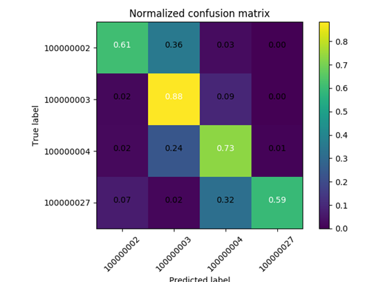

# Bài tập lớn môn Trí Tuệ Nhân Tạo

## Đề tài: Phân loại tàu thuyền

### Mô tả bài toán
Cho bộ dữ liệu HRSC2016 bao gồm 1680 ảnh tàu chụp từ vệ tinh. Được mô tả tại link [HRSC2016](https://sites.google.com/site/hrsc2016/)

Bộ dữ liệu được chia ra thành 2 phần train/val và test theo tỉ lệ 3 : 1

Yêu cầu xây dựng bộ phân lớp tàu theo các class và layer

### Usage
- ```preprocessing.py```: thực hiện tiền xử lý dữ liệu
- ```features.py```: thực hiện thử các phương pháp lấy features
- ```train.py```: thực hiện train và đánh giá model, sau đó dump để submit
- ```test.py```: thực hiện load và test model đã dump

### Kết quả thu được

#### Resample
- Acc = ___81.25%___
- Confusion Matrix: 



#### Balanced weight
- Acc = ___82%___
- Confusion Matrix: 


