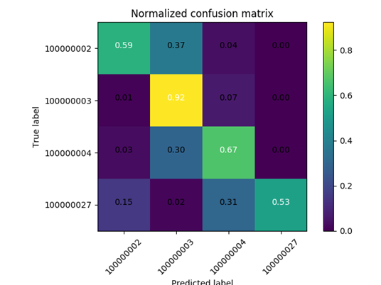

# Bài tập lớn môn Trí Tuệ Nhân Tạo

## Đề tài: Phân loại tàu thuyền

### Mô tả bài toán
Cho bộ dữ liệu HRSC2016 bao gồm 1680 ảnh tàu chụp từ vệ tinh. Được mô tả tại link [HRSC2016](https://sites.google.com/site/hrsc2016/)

Bộ dữ liệu được chia ra thành 2 phần train/val và test theo tỉ lệ 3 : 1

Yêu cầu xây dựng bộ phân lớp tàu theo các class và layer

### Usage
- ```preprocessing.py```: thực hiện tiền xử lý dữ liệu
- ```features.py```: thực hiện thử các phương pháp lấy features
- ```train.py```: thực hiện train và đánh giá model, sau đó dump để submit
- ```test.py```: thực hiện load và test model đã dump

Khởi tạo đối tượng cho bọ phân lớp và cho SIFT
```
clf = SVC(kernel="rbf", C=5, gamma=0.05, cache_size=10000, probability=False)
feat = cv2.xfeatures2d.SIFT_create(250, edgeThreshold=50, contrastThreshold=0.02)
```
thêm tham số ```class_weight="balanced"``` để tự điều chỉnh trọng số cho mỗi class

Khởi tạo model
```
bovw = BOVW(clf,
            feat,
            n_bags=250,
            is_resample=False,
            is_reuse=False,
            mini_batches=True,
            verbose=True)
```

nếu dữ liệu nhỏ hoặc ```is_resample=True``` thì đặt ```mini_batches=False``` để sử dụng Kmeans còn không thì để ```True``` sử dụng MiniBatchKmeans cho kết quả nhanh hơn

Train và Test
```
bovw.fit("images/train/")
acc = bovw.score("images/test/")
print(acc)
```

Percision và Recall
```
bovw.confusion_matrix("images/test/")
```

Cross Validation (dùng MiniBatchKmeans)
```
acc = bovw.cross_validation(["images/train/", "images/test/"])
print(acc)
```

Dump model
```
bovw.save_model("HRSC")
```

Load model
```
model = pkl.load(open("models/HRSC_new.sav", "rb"))

# Set features extractor
model.xfeat = cv2.xfeatures2d.SIFT_create(250, edgeThreshold=50, contrastThreshold=0.02)
```

### Kết quả thu được

#### Resample
- Kmeans
- Acc = ___81.25%___
- Confusion Matrix: 


#### Balanced class weight
- MiniBatchKmeans
- Acc = ___82.59%___
- Confusion Matrix: 


